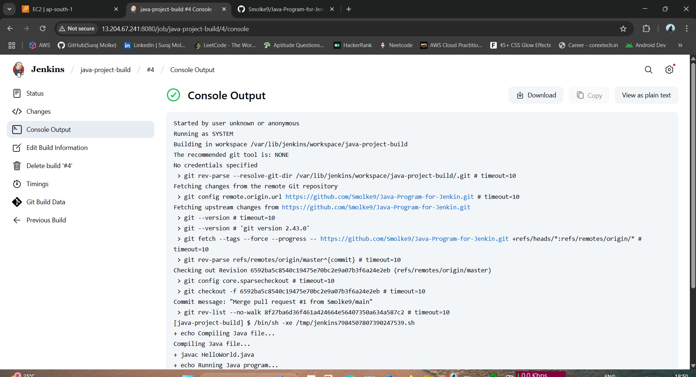

# Java HelloWorld Deployment with Jenkins on AWS Ubuntu

This guide explains how to deploy a **Java HelloWorld program** using **Jenkins** on an **AWS Ubuntu EC2** instance and optionally push the project to **GitHub**.

---

## ✅ Prerequisites

- AWS EC2 instance (Ubuntu)
- Jenkins installed and running
- Java installed (JDK)
- Git installed
- GitHub repository (public or with PAT if private)

---

## 🛠️ Step 1: Install Java, Git, and Jenkins

### Java

```bash
sudo apt update
sudo apt install default-jdk -y
```

### Git

```bash
sudo apt install git -y
```

### Jenkins

```bash
wget -q -O - https://pkg.jenkins.io/debian-stable/jenkins.io.key | sudo apt-key add -
sudo sh -c 'echo deb https://pkg.jenkins.io/debian-stable binary/ > /etc/apt/sources.list.d/jenkins.list'
sudo apt update
sudo apt install jenkins -y
sudo systemctl start jenkins
sudo systemctl enable jenkins
```

Access Jenkins: `http://<your-ec2-ip>:8080`

---

## 🚀 Step 2: Create Java HelloWorld Program

```bash
cd /var/lib/jenkins/workspace/
mkdir java-project-build
cd java-project-build
nano HelloWorld.java
```

Paste this content:

```java
public class HelloWorld {
    public static void main(String[] args) {
        System.out.println("Hello from Jenkins on AWS Ubuntu!");
    }
}
```

Save and exit.

---

## 🧪 Step 3: Test Java Program (Optional)

```bash
javac HelloWorld.java
java HelloWorld
```

Expected Output:

```
Hello from Jenkins on AWS Ubuntu!
```

---

## ⚙️ Step 4: Create Jenkins Freestyle Project

1. Go to Jenkins Dashboard → **New Item**
2. Name: `java-project-build`
3. Type: **Freestyle project** → Click **OK**
4. Scroll to **Build** section → Click **Add build step** → **Execute shell**

Paste this:

```bash
echo "Compiling Java file..."
javac HelloWorld.java

echo "Running Java program..."
java HelloWorld
```

5. Click **Save**

---

## ▶️ Step 5: Build and Verify

1. Click **Build Now**
2. Click build number → **Console Output**
3. Expected output:

```
Compiling Java file...
Running Java program...
Hello from Jenkins on AWS Ubuntu!
```

---

## 🔼 Step 6: Push Code to GitHub (Optional)

### Initialize and Push

```bash
cd /var/lib/jenkins/workspace/java-project-build/
git init
git remote add origin https://<USERNAME>:<TOKEN>@github.com/<USERNAME>/<REPO>.git
git add .
git commit -m "Java HelloWorld pushed from Jenkins AWS Ubuntu"
git branch -M main
git push -u origin main
```

> 🔒 Replace `<USERNAME>` and `<TOKEN>` with your GitHub username and Personal Access Token.

---

## ✅ Done!

You have:

- Deployed a Java HelloWorld app via Jenkins
- Configured Jenkins build steps
- Optionally pushed the code to GitHub

---

## 📌 Sample Output

```
Compiling Java file...
Running Java program...
Hello from Jenkins on AWS Ubuntu!
```


---

## 🧾 Author

Suraj Molke

---

## 📎 Tags

`#Java` `#Jenkins` `#Ubuntu` `#AWS` `#GitHub` `#CI/CD`

---

Happy Building! 🚀

